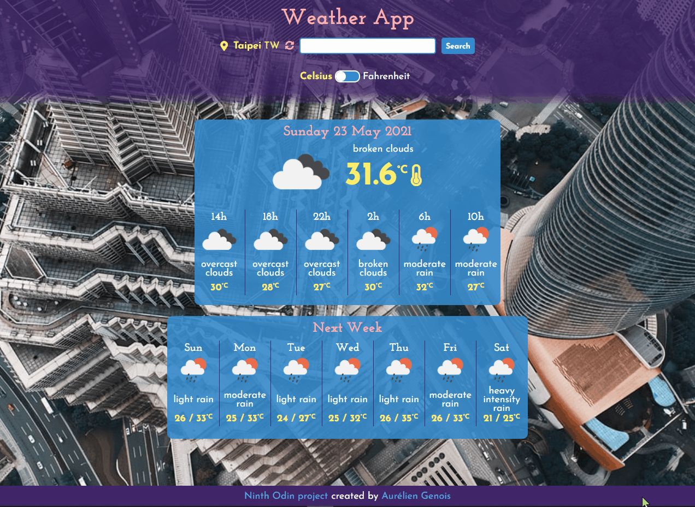
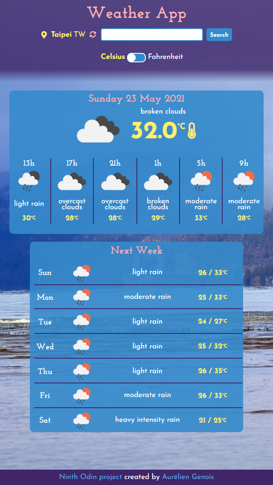

README draft
_ _ _

# Weather App

<h2 align="center"><a  href="https://aurelien-genois.github.io/weather-app/">Live Demo</a></h2>

## Description
The [ninth Odin project](https://www.theodinproject.com/paths/full-stack-javascript/courses/javascript/lessons/weather-app) is a weather web-application for practice asynchronous JavaScript (JSON, promise, fetching APIs, Async/Await).

## Features

- Can see the current and forecast (hourly, daily) weather for one city
- Can search a city and choose it among several suggestions (with their country ISO code)
- Can toggle the temperature unit between Celsius and Fahrenheit
- Can update the current/forecast weather

 

- The weather data are fetched with the OpenWeather API
- The background image is randomly fetched with the Unsplash API, with the current weather description as keyword
- The layout is suitable for small screens

 
 

## Challenges
Using together several libraries and APIs brings thinking the code differently and highlights the importance of the organization for both code and dependencies.

Add a step to choose the searched city between several suggestions (same city name but from different countries) was interesting to implement and not difficult thanks to the geocoding API already provided by OpenWeather.

Getting image from Unsplash with the Unsplash API was also instructing because it's more complexe than just fetching the data with the *fetch()* method with an URL (as the OpenWeather APIs) and requires to use the *unsplash-js* library.
